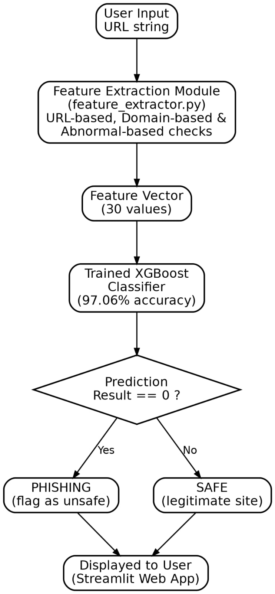
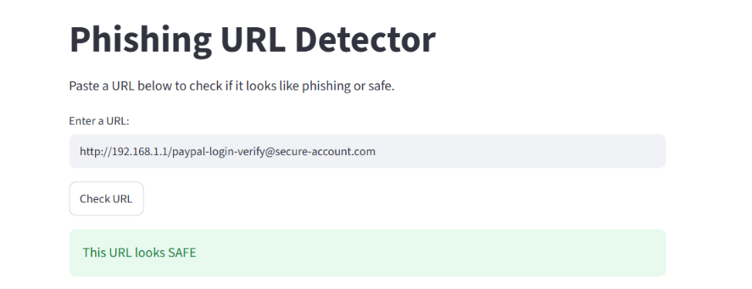
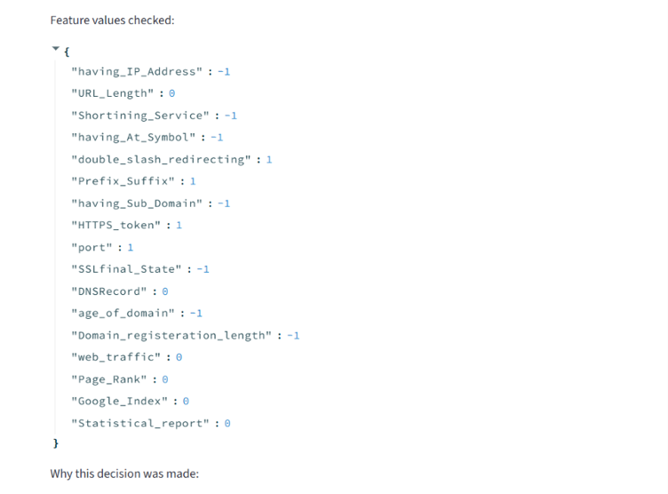
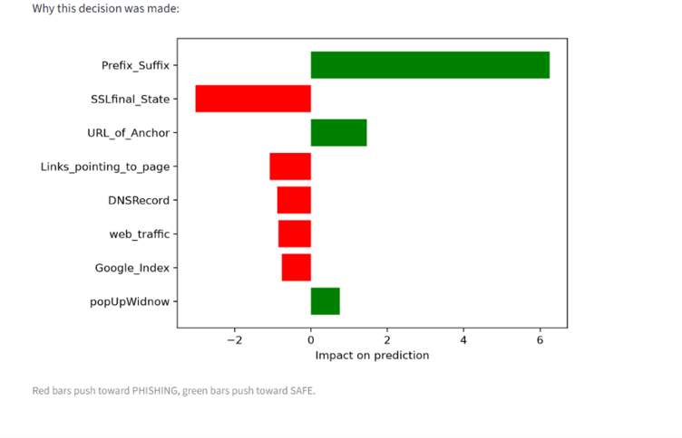
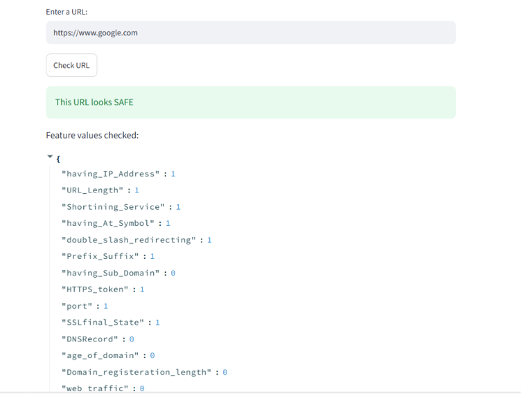
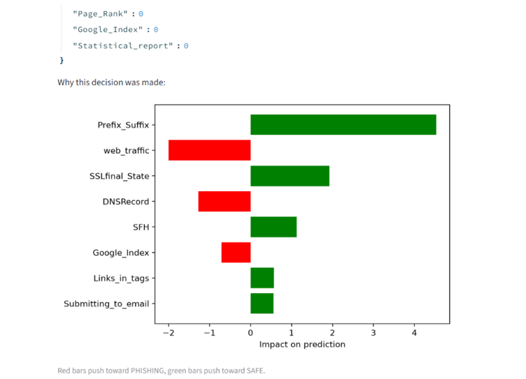
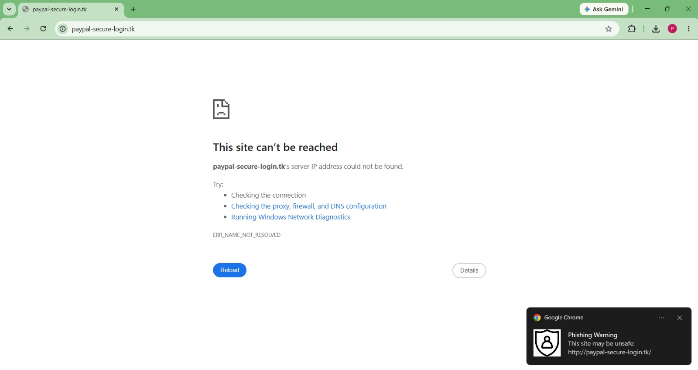

# Machine Learning Based Phishing URL Detector

ML-Based Phishing URL Detector is a cybersecurity project designed to identify malicious phishing URLs using machine learning algorithms. It includes a user-friendly web dashboard where users can enter a URL and receive instant predictions, helping improve awareness and online security.

## Problem Statement 

Phishing websites impersonate legitimate services to steal user credentials and sensitive data. This project builds a machine learning model that analyzes structural, domain, and abnormal characteristics of a URL to classify it as **Phishing** or **Legitimate**, then delivers real-time detection through a web application that warns users before they interact with a suspicious site.

## Dataset

  **Source:** UCI Machine Learning Repository — Phishing Websites Dataset 
  (Mohammad, R., & McCluskey, L., 2012)
  **Size:** 11,055 rows × 30 features + 1 target column
  **Target labels:** -1 = Phishing, 1 = Legitimate (relabeled to 0/1 for 
  model compatibility)
  **Feature categories:**
  - URL-based (e.g. IP address usage, URL length, use of "@", HTTPS token, 
    URL shortening service)
  - Domain-based (e.g. domain age, domain registration length, DNS record)
  - Abnormal-based (e.g. SSL certificate status)

## Tech Stack

  **Language:** Python
  **ML/Data:** pandas, scikit-learn, XGBoost
  **Web App:** Streamlit
  **Domain Lookups:** python-whois, dnspython
  **Environment:** VS Code, Git/GitHub

## System Architecture

This diagram shows the flow of the system - from URL input, through feature extraction (30 features across 4 categories), to prediction by the trained XGBoost model, and finally the Safe/Phishing result show to the user.

# Demo 

### Phishing URLs detected

### Safe URLs detected

The last two examples above also show SHAP explainability — the bar chart next to each prediction shows which features drove the decision. 

Red bars push the prediction toward "phishing," green bars push it toward "safe." This makes the model's decisions transparent instead of a black box.

## Real-Time Browser Warning

To make the tool more practical for everyday use, we added a warning popup feature — when a user searches or opens a phishing website, a popup alert appears on screen warning them before they click any link on that page, helping prevent accidental exposure to phishing attacks.

## Model Performance

| Model | Accuracy | Precision | Recall |
|---|---|---|---|
| Logistic Regression | 92.45% | 92.83% | 93.94% |
| Random Forest | 96.70% | 96.32% | 97.93% |
| **XGBoost (selected)** | **97.06%** | **96.48%** | **98.41%** |

XGBoost was selected as the final model due to its highest accuracy and recall, making it more reliable at correctly identifying phishing sites while minimizing false negatives.

 ## Known Limitations / Future Work

- Four domain-reputation features (`web_traffic`, `Page_Rank`, `Google_Index`, `Statistical_report`) currently default to a neutral value, since they originally relied on Alexa rank data, and Alexa officially shut down in 2022.A future improvement would be integrating a free alternative such as the  Tranco rank or Google Safe Browsing API.
- The app currently checks one URL at a time; batch URL scanning could be added as a future feature.
- The warning popup currently works within the app; converting it into a full browser extension would allow real-time protection while browsing normally.

## How to Run

1. Install requirements: `pip install streamlit xgboost scikit-learn pandas dnspython python-whois`
2. Run the app: `streamlit run app.py`
3. Enter any URL in the input box and click "Check URL"
   

## Contributions 

## Feature Extraction and Web App - Meenakshi

As Person B on this project, my main contribution was building the live feature extraction module, which converts any new URL entered by a user into the 30 features required by our trained model. Nine of these features were straightforward to extract directly from the URL text itself — for example, checking for IP addresses, "@" symbols, excessive sub-domains, or the use of URL-shortening services. Four features required live internet lookups, using libraries like python-whois and dnspython to check domain age, domain registration length, SSL certificate status, and DNS records. The remaining four features (such as web traffic rank and Google index status) depend on services like Alexa, which was officially shut down in 2022, so these were implemented to safely return a neutral/unknown value instead of breaking the app. This module was then connected to a Streamlit web app, allowing a user to paste a URL and instantly see a Phishing/Safe prediction along with the underlying feature values.

## Dataset and Model Training - Priyadharshini 

As Person A on this project, my contribution covered the data science and application-building pipeline. I set up the project environment and explored the UCI Phishing Websites dataset (11,055 rows, 31 columns), verifying data quality by checking for missing values and duplicates, confirming class balance (56% legitimate / 44% phishing), and running correlation analysis to identify the strongest predictors of phishing. I then split the data into training and test sets, trained baseline Logistic Regression and Random Forest models, and evaluated them using accuracy, precision, recall, F1-score, and confusion matrix visualization, along with feature importance rankings from Random Forest. On the application side, I built the Streamlit web app's user interface — including the input box, prediction button, and result display — integrated the final trained model for real-time predictions, and added a model comparison table (Logistic Regression vs. Random Forest vs. XGBoost) along with confusion matrix visualization directly into the app.

## Team
 
- [Meenakshi S] — Live feature extraction, web application, documentation
- [Priyadharshini K] — Dataset collection, model training & evaluation

## Citation

Mohammad, R., & McCluskey, L. (2012). Phishing Websites Dataset. 
UCI Machine Learning Repository.
